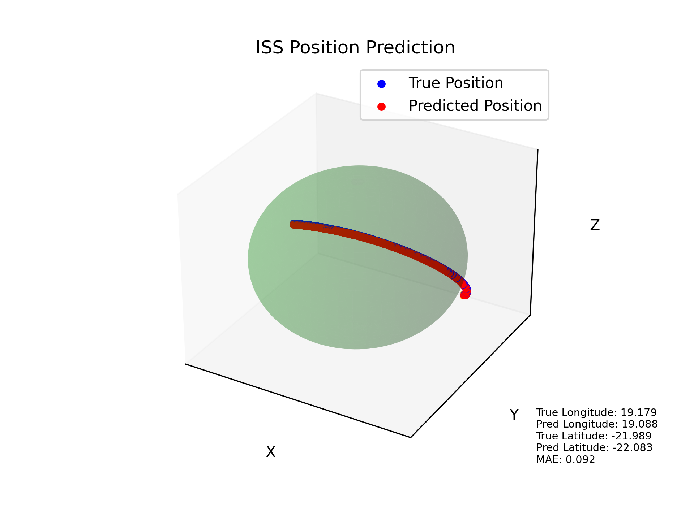

# International Space Station Position Prediction Project

The goal of the project is to develop a system for predicting the position of the International Space Station (ISS) in geographical coordinate space. To achieve this goal, a set of tools and scripts has been prepared to collect data, train the model and visualize the actual and predicted position of the ISS.

> Project by [Bandi Revanth](https://github.com/bandirevanth). Ideated by & special thanks to [ML Abhinav](https://github.com/astroabhi30)

## Installation

1. Clone the repository:

    ```bash
    git clone https://github.com/celestium-nova/iss-position-prediciton
    cd iss-position-prediction
    ```

2. Python Version:

   This project is developed using Python version 3.10.13.

3. Virtual Environment:

   It is recommended to use a virtual environment to manage dependencies and isolate the project environment.

4. Install the project:

    After activating the virtual environment, navigate to the project directory and install the project using the following command:

    ```bash
    pip install .
    ```

## Documentation

The `docs` folder contains documentation for the executable files that are part of this project.

### 1. generate_dataset.py

- **Description:** The `generate_dataset.py` file contains a script for generating a dataset.
- **Instructions:** To generate a dataset, run this script and provide the appropriate parameters.

### 2. train_pipeline.py

- **Description:** The `train_pipeline.py` file contains a script for processing and training the model.
- **Instructions:** To run the model training process, execute this script, providing the appropriate input data.

### 3. visualization.py

- **Description:** The `visualization.py` file contains a script for visualizing data and results.
- **Instructions:** Run this script to generate plots and visualizations of data.

### 4. app.py

- **Description:** The `app.py` file contains a script for running the application.
- **Instructions:** Run this script to start the application in interactive mode.

<p align='center'>
    
</p>